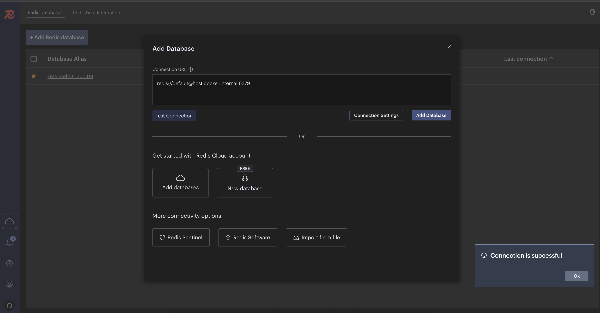
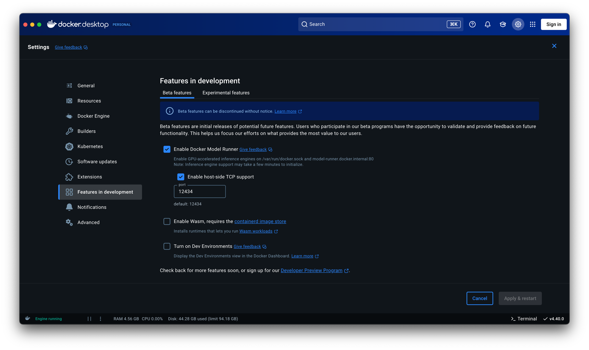
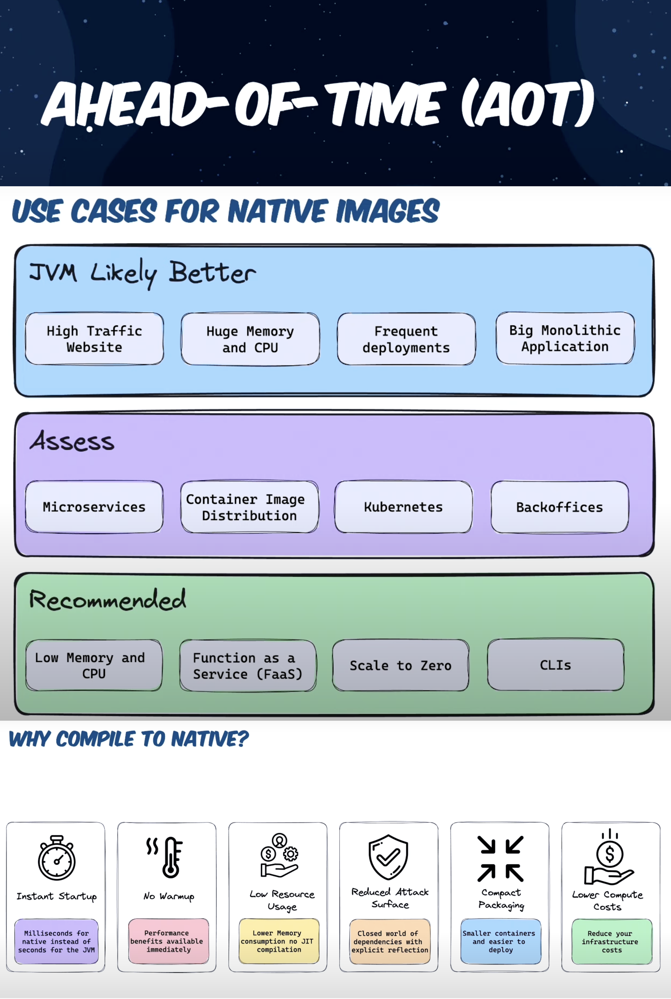
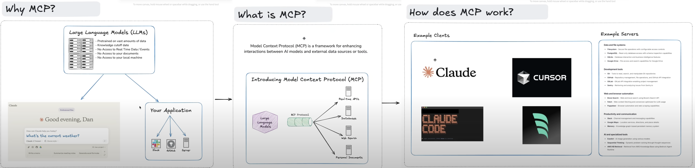

## OAuth2 Authorization Server with Spring Boot 3 and Java 24

#### Prerequisites

- Java 24 should be installed --> `export JAVA_HOME=$(/usr/libexec/java_home -v 24)`
- Maven should be installed
- Docker should be installed
- Postman can be installed

#### How to Run and Test

- Run `export DEEPSEEK_API_KEY=your_api_key_here` command to set DeepSeek API key
- Run `docker-compose up -d` command to run necessary services
- Run `mvn test` or `mvn clean install` or `mvn clean package` or `./mvnw clean install` command to run all the tests
- Run `mvn spring-boot:run` command to run the application
- Import the followings to test in Postman
    - [OAuth2 Authorization Server.postman_collection.json](docs/postman/OAuth2%20Authorization%20Server.postman_collection.json)
    - [OAuth2 Authorization Server.postman_environment.json](docs/postman/OAuth2%20Authorization%20Server.postman_environment.json)
- Swagger: http://localhost:9000/swagger-ui/index.html
    - Click `Authorize` and enter the following credentials
    - `client_id`: `client`
    - `client_secret`: `secret`
    - Use one of the following default values to log in http://localhost:9000/login
        - username: `Developer` password: `password`
        - username: `Admin` password: `password`
        - username: `User` password: `password`
- Actuator: http://localhost:9000/actuator/
- Database credentials
    - `url`: `jdbc:mariadb://localhost:3306/oauth2_authorization_server`
    - `username`: `mb_test`
    - `password`: `test`
- Redis
    - `host`: `localhost`
    - `port`: `6379`
- Redis Insight: http://localhost:5540/
    - Click `Add Redis database`
    - `Connection URL` --> `redis://default@host.docker.internal:6379`
    - Click `Add Database`
    - 
- Ollama
    - http://localhost:3000/ sign up for an account for local environment
    - Search for `mxbai-embed-large` and download it if it does not exist
    - Search for `deepseek-r1:7b` and download it if it does not exist

#### Debugging Spring Boot Tests in IntelliJ IDEA

1. Run one of the below commands in the terminal
    - `mvn test -Dmaven.surefire.debug`
    - If port 5005 is already in use, you can specify a custom port
        - `mvn test -Dmaven.surefire.debug="-Xdebug -Xrunjdwp:transport=dt_socket,server=y,suspend=y,address=8000"`
2. Open IntelliJ IDEA
3. Go to `Run > Attach to Process` (or use shortcut)
    - Windows/Linux: `Ctrl + Alt + 5`
    - Mac: `Cmd + Alt + 5`
4. Select the Java process running your tests
5. The test will pause until you connect your debugger. Once connected, you can use breakpoints and step through your
   code.

#### How to Run and Test Native Image with GraalVM

- Java 24 GraalVM edition should be installed
- Run `docker-compose up -d` command to run necessary services
- Run `./mvnw -Pnative native:compile` or `./mvnw -Pnative native:compile -DskipTests` command to build the native image
- Run `./target/oauth2-authorization-server` command to run the native image
- Install [Grype](https://github.com/anchore/grype) (OPTIONAL)
    - Run `native-image-inspect ./target/oauth2-authorization-server-0.0.1 | grype -v` command to scan vulnerabilities
- Run `native-image-inspect ./target/oauth2-authorization-server-0.0.1 >output.json` command and open `output.json` or
  visit http://localhost:9000/actuator/sbom/native-image to inspect all libraries, methods etc. used in the native image
- Run `open ./target/oauth2-authorization-server-build-report.html` to see build report
- Use Swagger UI to test the application

#### Spring Boot with CRaC(Coordinated Restore at Checkpoint) by Creating Ready to Restore Container Image.

- **Warning:** for real projects make sure to not leak sensitive data in CRaC files since they contain a snapshot of the
  memory of the running JVM instance.
- **Checkpoint**
    - Run
      on [demand checkpoint/restore of a running application](https://docs.spring.io/spring-framework/reference/6.1/integration/checkpoint-restore.html#_on_demand_checkpointrestore_of_a_running_application)
      with: `./docs/scripts/checkpoint.sh`
    - Run
      an [automatic checkpoint/restore at startup](https://docs.spring.io/spring-framework/reference/6.1/integration/checkpoint-restore.html#_automatic_checkpointrestore_at_startup)
      with: `./docs/scripts/checkpointOnRefresh.sh`
- **Restore**
    - Restore the application with: `./docs/scripts/restore.sh`
- Use Swagger UI to test the application

#### How to Run and Test AI Models Locally with Docker Desktop Model Runner

- Requires: Docker Desktop 4.40 and later
- Run `docker-compose up -d` command to run necessary services
- Run `docker model pull ai/gemma3:4B-Q4_K_M` command to pull the model
    - Run `docker model run ai/gemma3:4B-Q4_K_M` command to run the model to test it from the command line (OPTIONAL)
- `Docker Desktop` --> `Settings` --> `Features in development` --> `Beta features` --> `Enable Docker Model Runner` -->
  `Enable host-side TCP support` --> `Apply & Restart`
    - 
- Run `mvn test` or `mvn clean install` or `mvn clean package` or `./mvnw clean install` command to run all the tests
- Run `mvn spring-boot:run` command to run the application
- Use Swagger UI to test the application

#### References

- [Spring Boot 3 Tutorial Security OAuth2 Spring Authorization Server Save login data to a database](https://www.youtube.com/watch?v=rVAqh-VDw2o)
- [Spring Boot LDAP Authentication from scratch with Spring Security and LDAP Server](https://www.youtube.com/watch?v=figTvA-MAZA)
- [BCryptPasswordEncoderTests](https://github.com/spring-projects/spring-security/blob/main/crypto/src/test/java/org/springframework/security/crypto/bcrypt/BCryptPasswordEncoderTests.java)
- [Getting started with Spring Boot AOT + GraalVM Native Images](https://www.youtube.com/watch?v=FjRBHKUP-NA)
    - 
- [Welcome, GraalVM for JDK 24!🚀](https://medium.com/graalvm/welcome-graalvm-for-jdk-24-7c829fe98ea1)
- [A vulnerability scanner for container images and filesystems Grype](https://github.com/anchore/grype)
- [Introduction to Project CRaC: Enhancing Runtime Efficiency in Java & Spring Development](https://www.youtube.com/watch?v=sVXUx_Y4hRU)
- [Model Context Protocol (MCP)](https://modelcontextprotocol.io/introduction)
    - [MCP Server Boot Starter](https://docs.spring.io/spring-ai/reference/api/mcp/mcp-server-boot-starter-docs.html)
    - [Model Context Protocol (MCP) Explained: How to Give AI Access to Your Files, Web Searches & More](https://www.youtube.com/watch?v=nNLshWCoe0o)
    - 
- [Ollama Installation with Docker Compose](https://geshan.com.np/blog/2025/02/ollama-docker-compose/)
    - [Ollama Chat](https://docs.spring.io/spring-ai/reference/api/chat/ollama-chat.html)
- [A Guide to Spring AI Advisors](https://www.baeldung.com/spring-ai-advisors)
- [Testing LLM Responses Using Spring AI Evaluators](https://www.baeldung.com/spring-ai-testing-ai-evaluators)
- [Vector Databases](https://docs.spring.io/spring-ai/reference/api/vectordbs.html)
- [Java + RAG: Create an AI-Powered Financial Advisor using Spring AI 💡](https://www.youtube.com/watch?v=6Pgmr7xMjiY)
    - [Retrieval Augmented Generation (RAG)](https://docs.spring.io/spring-ai/reference/api/retrieval-augmented-generation.html)
    - 
- [Run AI Models Locally: Zero API Keys, Zero Fees with Docker Desktop Model Runner](https://www.youtube.com/watch?v=6E6JFLMHcoQ)
    - [Docker Model Runner](https://docs.docker.com/desktop/features/model-runner/)
- [A Step-by-Step Guide for Installing and Using AppMap for Java](https://appmap.io/blog/2021/09/07/mapping-java-applications-tutorial/)
    - [AppMap Maven plugin](https://appmap.io/docs/reference/appmap-maven-plugin)
    - [AppMap: Free AI Architect IntelliJ Plugin](https://plugins.jetbrains.com/plugin/16701-appmap-free-ai-architect)